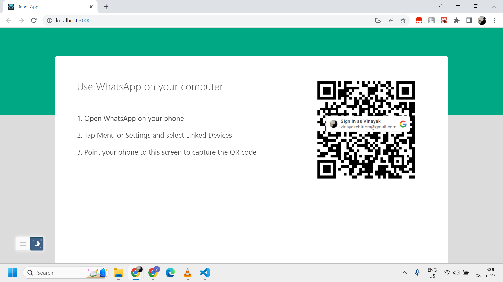
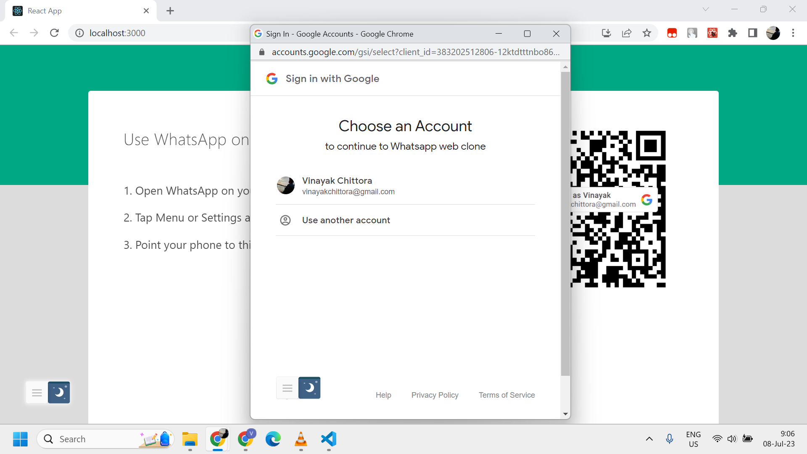
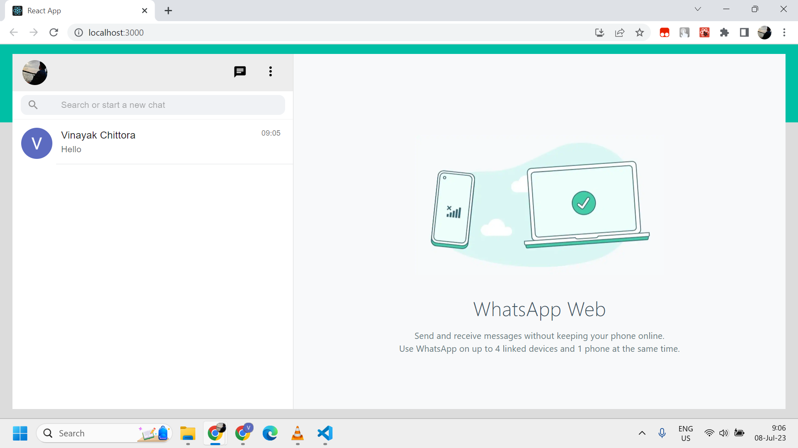
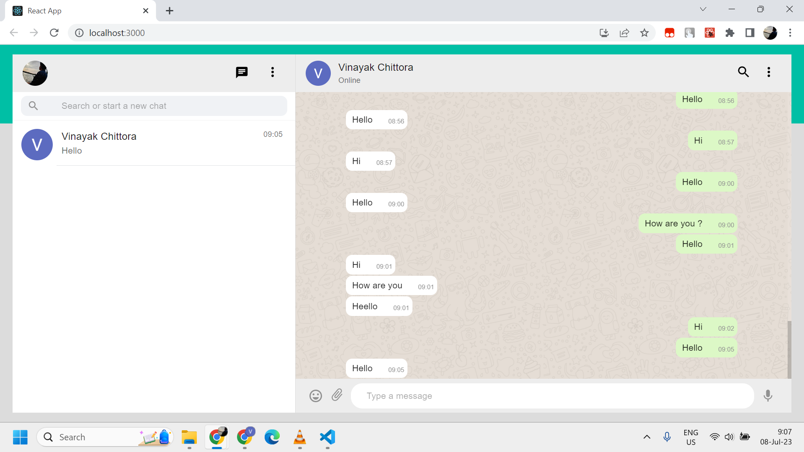
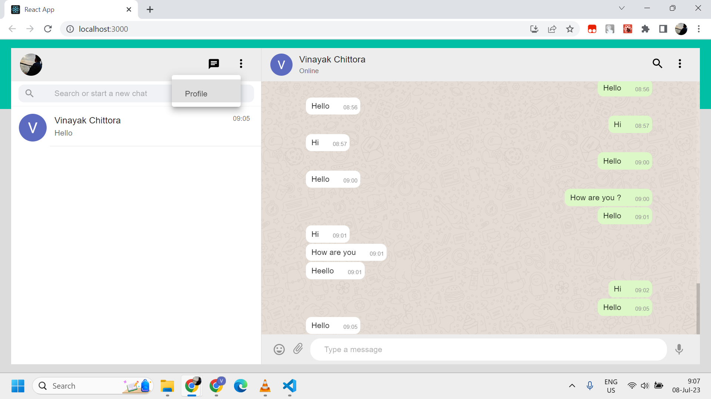
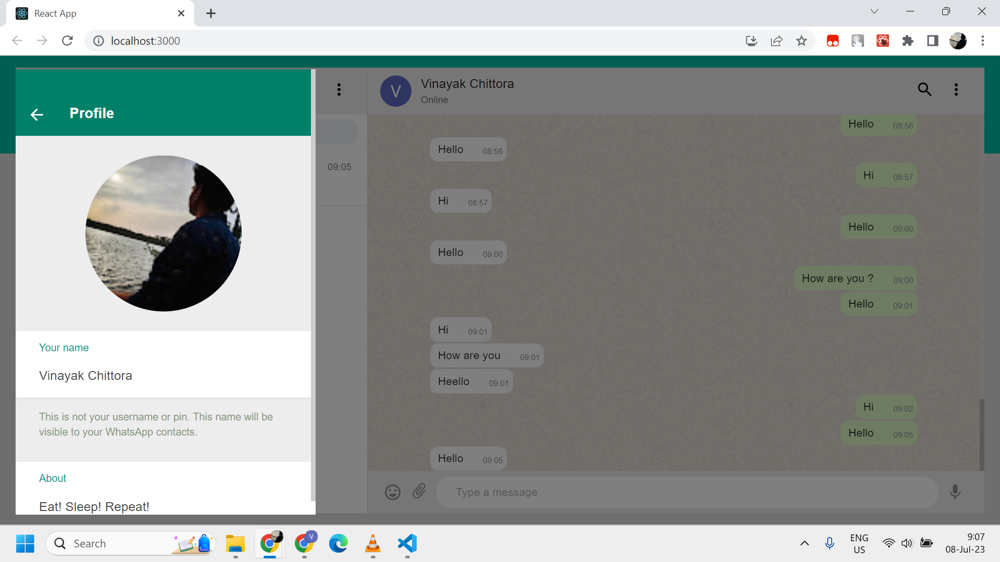

<b>WhatsApp clone build using MERN stack</b>
---


#### 🧾 Description

Its build using MERN stack and uses <a href='https://socket.io/'>socket.io</a> for realtime messaging, online statuses, typing indicators, notifications etc.

#### ✨ Features

- [x] User authentication.
- [x] Search for users to chat with.
- [x] Chat in realtime with <a href='https://socket.io/'>socket.io</a>.
- [x] User's realtime online/offline status in private chat.
- [x] Responsive upto a limit.
- [x] And most importantly 😎 Feels just like whatsapp-web (or Desktop app).

#### ⚙ Tools and Technologies used

###### Frontend

1. [React.js](https://reactjs.org/)
2. [Material-ui](https://mui.com/)

###### Backend

1. [Node.js](https://nodejs.org/en/)
2. [Express.js](https://expressjs.com/)
3. [MongoDB](https://www.mongodb.com/)
5. [Socket.io](https://socket.io/)

#### 🛠 Installation and setup

1. Clone the repo to your local machine.
2. Install the required dependency for server using :

   ```javascript
   cd server
   npm install
   ```

3. Install the required dependency for client using :

   ```javascript
   cd client
   npm install
   ```

4. Install the required dependency for socket using :

   ```javascript
   cd socket
   npm install
   ```

5. Create a .env file inside the server folder and provide the following environment variables:

   ```
   DB_USERNAME=<your-db-username>
   DB_PASSWORD=<your-db-password>
   
   ```

6. Start the express server using :

   ```javascript
   npm start
   ```

7. Start the react development server using:

   ```javascrip
   cd client
   npm start
   ```

8. Start the socket using:

   ```javascrip
   cd socket
   npm start
   ```
9 Open your web browser and visit http://localhost:3000 to access the Discord clone. 

<p align='center'>

<br>
<br>

<br>
<br>

<br>
<br>

<br>
<br>

<br>
<br>

</p>

<!-- CONTACT -->
## Contact

<a target="_blank" href="https://www.linkedin.com/in/vinayak-chittora/">
 
</a>
<a target="_blank" href="mailto:vinayakchittora31@gmail.com">
 
</a> 

<br>
<br>
<br>

<p align='center'>
(If you liked the project, give it star 😃)
</p>